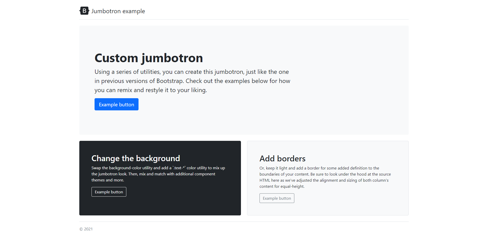

# Bootstrap Lab

## Overview
Create this web page using bootstrap

## Hint
Do your best to do this on your own by reading the Bootstrap5 [documentation](https://getbootstrap.com/docs/5.2/getting-started/introduction/) since that's how you will learn the most and getting used to read the documentation will actually help you with with your career. However, if you're stuck, you can use this [link](https://getbootstrap.com/docs/5.2/examples/jumbotron/) to see the real example of this webpage. Simply use devtools `right click on the page and click on inspect` check the classes used for reference from the elements tab.

## Todo
- Create the layout you see in this image

